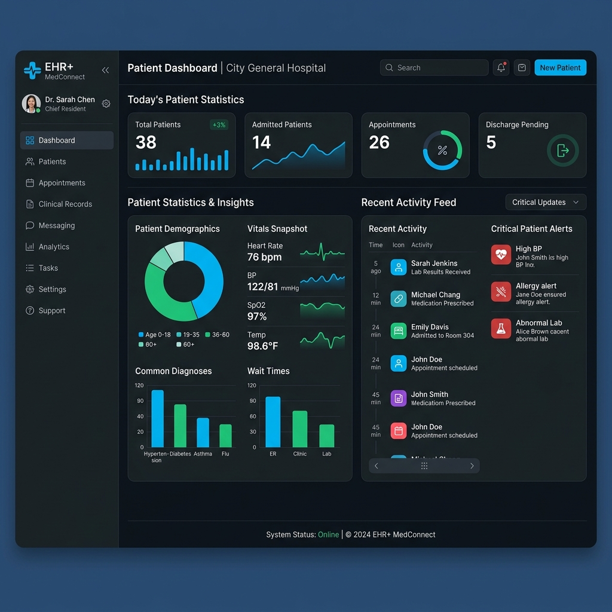

# 🏥 Secure EHR Platform — Patient Record Sharing System


[](https://opensource.org/licenses/MIT)
[]()
[]()
[]()
[]()
[]()

A production-grade **Electronic Health Record (EHR)** platform engineered for high-security environments and seamless inter-hospital data exchange. Records are encrypted at rest using AES-256-GCM, all data access is logged in a tamper-evident SHA-256 audit hash chain, and inter-hospital key exchange uses ECDH P-256.

---

## ✨ Key Features

### 🔐 Advanced Security & Privacy
*   **Zero-Knowledge Ready**: Records are encrypted at rest using **AES-256-GCM**.
*   **Inter-Hospital Trust**: Secure key exchange using **ECDH P-256** for encrypted payload delivery between medical institutions.
*   **Immutable Audit Trail**: Every data mutation is logged in a **SHA-256 hashed chain**, making the history tamper-evident.
*   **Granular Access Control**: Role-Based Access Control (RBAC) combined with attribute-based logic (CP-ABE).

### 👩‍⚕️ Clinical Workflow
*   **Unified Patient Dashboard**: A comprehensive view of patient history, medical records, and consultation timelines.
*   **Phonetic Search**: High-performance patient lookup using the **Soundex** algorithm.
*   **Consent Management**: Patient-centric consent flows for record sharing between hospitals.

---

## 📸 Screenshots

| Dashboard View | Security Visualization |
|:---:|:---:|
|  |  |

---

## 🛠️ Technology Stack

| Layer | Technology |
|---|---|
| **Frontend** | React 18, Vite, TypeScript, Tailwind CSS, Zustand, React Router v6, Axios |
| **Backend** | FastAPI 0.111, Python 3.11, Uvicorn |
| **Database** | MongoDB 7 (Motor async driver) |
| **Cryptography** | AES-256-GCM, ECDH P-256, PBKDF2, bcrypt, SHA-256 |
| **Auth** | JWT (HS256), 8-hour expiry, dual revocation check |
| **Infrastructure** | Docker, Docker Compose |

---

## 🛡️ Security Implementation Details

| Feature | Implementation |
|---|---|
| **AES-256-GCM** | EHR record content encrypted before storage. `encryptedContent = base64(ciphertext + GCM_tag)`. IV stored separately. |
| **ECDH P-256** | Each user has an ECDH P-256 key pair. Used for inter-hospital encrypted payload exchange. Keys rotatable via API. |
| **bcrypt (cost=12)** | Passwords hashed with bcrypt. Never stored or transmitted in plaintext. |
| **JWT Authentication** | 8-hour expiry. Role and CP-ABE attributes embedded in payload. |
| **CP-ABE Access Control** | Records have `accessPolicy` (list of required attributes). Server-side `can_access()` check on every decrypt request. |
| **SHA-256 Audit Chain** | Every write action produces a chained audit entry: `hash = SHA256(prevHash + entry_data)`. Tamper detection via `/audit/verify`. |
| **User Revocation** | Dual-write revocation: `users.isRevoked = True` + entry in `revocation_list`. Checked on every request. |

---

## 🏗️ Architecture

### Frontend (React + Vite)
Single-page application with React Router v6. Authentication state persisted in **Zustand** with localStorage. All API calls via an Axios client with a JWT interceptor. Protected routes redirect to `/login` if unauthenticated. Role-based sidebar navigation hides admin-only pages from non-admin users.

### Backend (FastAPI)
9 modular routers, each handling a logical group of endpoints. `get_current_user` dependency decodes JWT and performs dual revocation checks. The `write_audit_log` utility is called from every write endpoint to ensure no mutation goes unrecorded.

### Cryptography Layer (`backend/crypto/`)
Four standalone modules with no FastAPI dependencies:
- **`aes.py`**: AES-256-GCM encrypt/decrypt with PBKDF2 key derivation.
- **`ecdh.py`**: ECDH P-256 key pair generation, HKDF shared secret derivation, fingerprinting.
- **`hashing.py`**: bcrypt password hashing + SHA-256 audit chain computation.
- **`soundex.py`**: Soundex phonetic algorithm for fuzzy patient name matching.

---

## 🚀 Quick Start

### 1. Build and start all services
```bash
docker compose up --build -d
```
*First build takes 3–5 minutes. Subsequent starts take ~15 seconds.*

### 2. Seed the database with demo data
```bash
docker compose run --rm seed
```

### 3. Access the application
| Service | URL |
|---|---|
| **Frontend** | http://localhost:5173 |
| **API Docs (Swagger)** | http://localhost:8000/docs |
| **Health Check** | http://localhost:8000/health |

---

## 🔑 Demo Credentials
All accounts use the password: **`Password@123`**

| Email | Role | Hospital |
|---|---|---|
| `superadmin@ehr.in` | Super Admin | City General |
| `dr.priya@citygeneral.in` | Doctor (Cardiology) | City General |
| `srihari@patient.in` | Patient | City General |
| `admin@citygeneral.in` | Admin | City General |

---

## 🛠️ Development & Debugging

```bash
# View logs
docker compose logs -f backend

# Stop + wipe all data (fresh start)
docker compose down -v

# Rebuild after requirements.txt or Dockerfile change
docker compose up --build backend

# Open MongoDB shell
docker exec -it ehr_mongodb mongosh ehrdb
```

---

## 🚧 Known Limitations (Production Hardening Required)

| Item | Current | Production Change |
|---|---|---|
| **AES salt** | Static `b"EHR-SALT-2024-STATIC"` | Per-record random salt stored with IV |
| **KMS** | Single password-derived key | Per-record DEK wrapped by AWS KMS / HashiCorp Vault |
| **JWT algorithm** | HS256 (symmetric) | RS256 (asymmetric) for multi-service |
| **Token blacklist** | None — revocation via DB query | Redis `jti` blacklist for instant logout |

---

## 👥 The Team

Meet the minds behind the Secure EHR Platform:

*   **SAI SHRAVAN** ([@Soy-7](https://github.com/Soy-7)) 
*   **SRIHARI** ([@srihari-codes](https://github.com/srihari-codes))
*   **RAKAVI** ([@rakavip2-bot](https://github.com/rakavip2-bot)) 

---

## 📄 License
Distributed under the MIT License. See `LICENSE` for more information.

<p align="center">
  Built with ❤️ for Secure Healthcare
</p>
